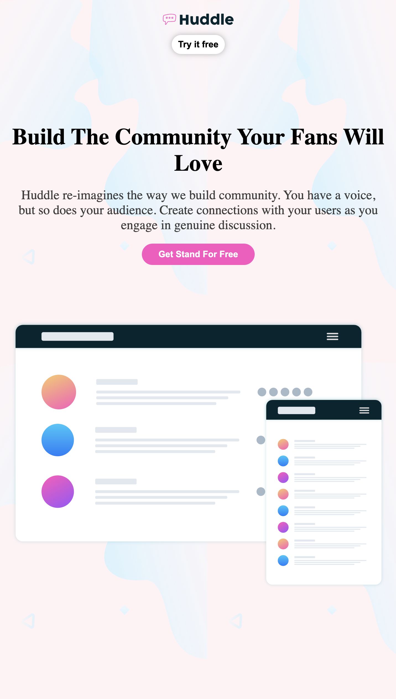

# Huddle landing page

## Expérience :

## Spécification:

### HTML
- importation du style de police avec link
-
-

### CSS
- text-transform : pour donner à vos phrase(mots) un style spécifique comme être complètement en majuscule ou en minuscle ou capitalise(chaque mots commence par une lettre majuscule)
- float : pour mettre le contenu flotant c'est à dire d'être à droit ou à gauche dans son contenue
- transform : pour deplacer par rapport à sa position initiale sur tout les direction
- in-width : la valeur minumale
- scale : pour grandir ou reduire l'élément concerner
- transition : transition entre deux état
- 

## capture d'écran Desktop 

## capture d'écran mobile
